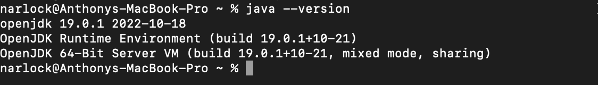
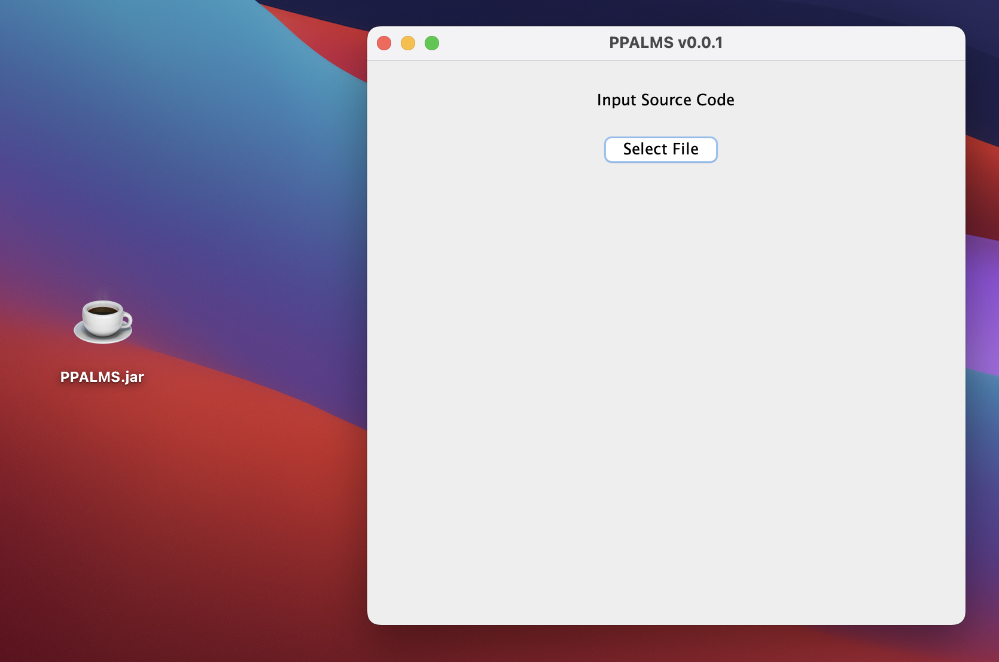
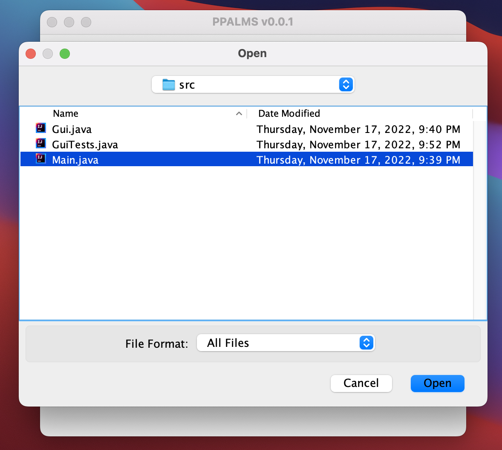
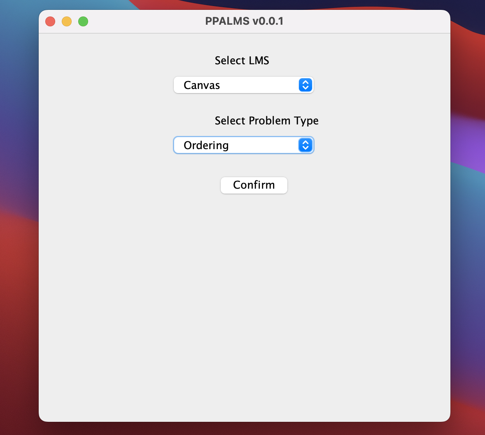
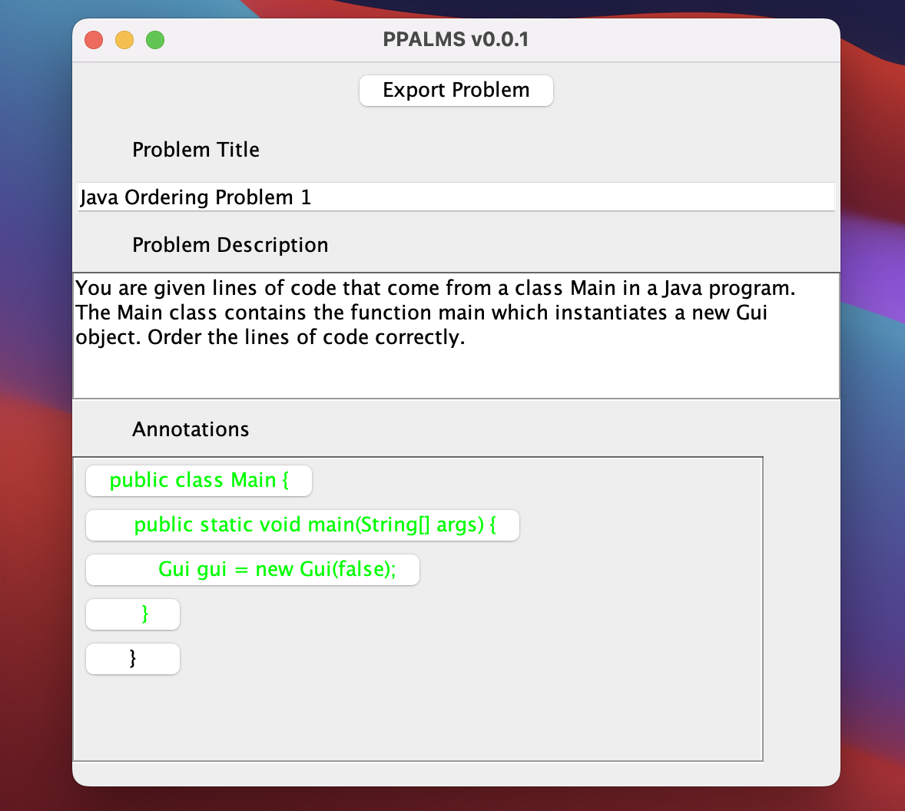

# PPALMS v0.1
[Parson’s problems](https://en.wikipedia.org/wiki/Parsons_problems) are a form of assessment which differ from the typical code writing form of question on a typical exam in an introductory computer science class. The purpose of this application is to allow users to create a Parson's problem and export that problem to their LMS of choice. In version 0.1, the application supports only *ordering* problems.

This is the first version of the PPALMS application. This document provides information related to instructing users to run the program and how the program is built and executed.

## Group Roster and Contributions

| Member Name  | x500 | GitHub | Contribution | 
| ------------- | ------------- | ------------- |------------- |
| Anthony Narlock | narlo041  | [narlock](https://github.com/narlock) | UI Design & Development, MVC Developer, Code Documentation, Tester, Test Documentation, README Creator. |
| Stephanie Ye | ye000080  | [Ye000080](https://github.com/Ye000080) | Tester, Test Documentation. |
| Jaden Rodriguez | rodr0571 | [YaBoiSkinnyP](https://github.com/yaboiskinnyp) | Logic and Export Developer, Code Documentation, Test Documentation. | 
| Shen Lua | lua00005 | [cshenlua](https://github.com/cshenlua) | Tester, Test Documentation. |

## How to build/execute the program.

### Java
To run the PPALMS application, you must be on a device that supports Java Runtime Environment version 8 or higher. It is trivial to note that Java applications run on computers that have popular operating systems like Windows, Linux, and macOS. This document assumes that the user of this application is running the PPALMS application in an operating system that supports Java version 8 or higher. This document also makes the assumption that the user has external peripherals to make use of the PPALMS application like a monitor for displaying the application, a keyboard for processing user key inputs, and a mouse for selecing and clicking buttons and combo boxes on the user interface. The figure below provides a visual representation of how to check if you have Java installed on your computer. In a command line, type the following command.

```
java --version
```

If you have Java installed on your machine, you may see something similar to the following:



If you do not see something similar to the image above, you can click [this link](http://java.com/) to download Java. This document assumes that the user is able to figure out how to install an application on their computer, so instructions on installing Java will not be mentioned.

### Running the application
Now that you have verified that you have an installation of Java (version 8 or higher), you may now proceed to run the application. The application is in the form of a Executable JAR file titled `PPALMS.jar`. The user can simply run this application using the Java Runtime Environment. The process is the same for any operating system. The following image displays the application on a user's desktop and it running.



### Using the PPALMS Application
To begin using the application, the user can click on the "Select File" on the user interface. This will send a signal from the controller to open the file chooser dialog menu. From here, the user can select their source code file to upload. Please note, the input file must be a supported programming file type. As of version 0.1 of the PPALMS application, the file extensions `.java`, `.py`, `.c`, `.cpp`, and `.cc` are supported. The following image shows the user selecting a file. Please note that if you are running a version of macOS, there is a possibility you have not granted your Java environment to your file system. The user is assumed to have granted permissions of the Java Runtime Environment to their operating system as that is out of the scope of this application and may vary depending on the user's operating system.



Once the file is selected, the view will change to indicate that the user can input their target LMS and problem type. As already stated, version 0.1 only provides the *ordering* option to the user. The following image shows a sample form filled out. After the form is filled out, the user will be able to confirm their selections by clicking the confirm button. This will change the view to allow the user to input specific information for their problem.



On the following image below, we can see the user has entered a title, description, and selected annotations (in the case of the ordering problem, the user can click on the lines of code they wish to include in their problem) from their source code. The user can now hit the export button which will generate a JSON file of their created problem.


